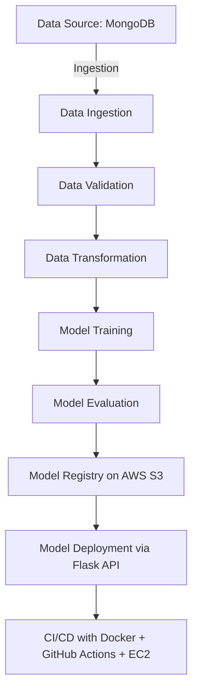

# 🚀 Vehicle Insurance MLops Project


A complete **end-to-end MLops pipeline** for vehicle insurance prediction, integrating:

* 📦 **Project packaging** with `setup.py` & `pyproject.toml`
* 🗄 **MongoDB Atlas** for dataset storage
* 📝 **Logging & Exception handling**
* ⚙️ **Modular components** (Data Ingestion → Validation → Transformation → Training → Evaluation → Deployment)
* ☁️ **AWS S3** for model registry
* 🐳 **Docker + GitHub Actions CI/CD** pipeline for automated deployment on **AWS EC2**

---

## 📂 Project Setup

### 🔧 Step 1: Project Template

```bash
python template.py
```

### 📦 Step 2: Package Management

* Local packages imported via `setup.py` & `pyproject.toml`
* More details: `crashcourse.txt`

### 🌱 Step 3: Virtual Environment & Dependencies

```bash
conda create -n vehicle python=3.10 -y
conda activate vehicle
pip install -r requirements.txt
pip list   # verify installation
```

---

## 🗄 MongoDB Atlas Setup

1. Create free **M0 cluster** on MongoDB Atlas.
2. Setup DB user and whitelist IP (`0.0.0.0/0`).
3. Copy **connection string** for Python driver.
4. Push dataset from Jupyter Notebook (`mongoDB_demo.ipynb`).
5. Verify data in **Atlas collections**.

---

## 📝 Logging & Notebooks

* **Logger** (`logger.py`) and **Exception handler** (`exception.py`) tested via `demo.py`.
* **EDA & Feature Engineering** in `notebooks/`.

---

## 📊 Data Pipeline Components

### 1️⃣ Data Ingestion

* Configured in `constants`, `mongo_db_connections.py`, `proj1_data.py`.
* Converts MongoDB JSON → Pandas DataFrame.

### 2️⃣ Data Validation

* Uses `utils.main_utils.py` + `config.schema.yaml`.

### 3️⃣ Data Transformation

* Feature engineering & preprocessing.

### 4️⃣ Model Training

* Custom estimators & ML algorithms defined in `estimator.py`.

---

## ☁️ AWS Integration

* **IAM Users** for secure access.
* **S3 Bucket** (`my-model-mlopsproj`) for model registry.
* Environment variables for access keys:

  ```bash
  export AWS_ACCESS_KEY_ID="XXXX"
  export AWS_SECRET_ACCESS_KEY="YYYY"
  export AWS_DEFAULT_REGION="us-east-1"
  ```
* `s3_estimator.py` handles push/pull of models.

---

## 🤖 Model Evaluation & Deployment

* **Threshold-based evaluation** (`MODEL_EVALUATION_CHANGED_THRESHOLD_SCORE = 0.02`).
* **Model Pusher** uploads trained model to **S3 registry**.
* `app.py` powers the **Prediction Pipeline** with Flask.

---

## ⚙️ CI/CD Pipeline

### 🐳 Dockerization

* `Dockerfile` & `.dockerignore` configured.

### 🔄 GitHub Actions → AWS EC2 Deployment

1. Create **ECR repo** (`vehicleproj`).
2. Launch **EC2 Ubuntu instance**.
3. Configure **Self-hosted GitHub Runner**.
4. Add GitHub **Secrets**:

   * `AWS_ACCESS_KEY_ID`
   * `AWS_SECRET_ACCESS_KEY`
   * `AWS_DEFAULT_REGION`
   * `ECR_REPO`

### 🚀 Auto Deployment

* Every push triggers build & deploy to **EC2**.
* App available at:

  ```
  http://<EC2_PUBLIC_IP>:5080
  ```
* Training API:

  ```
  http://<EC2_PUBLIC_IP>:5080/training
  ```

---

## 🛠 Tech Stack

* **Programming**: Python (3.10)
* **Database**: MongoDB Atlas
* **ML Frameworks**: Scikit-learn, Pandas, Numpy
* **Cloud**: AWS (S3, EC2, IAM, ECR)
* **MLOps**: Docker, GitHub Actions CI/CD
* **Logging & Monitoring**: Custom Logger + Exception Handler

---

## 📌 Project Workflow



---

## 🌟 Key Features

* ✅ End-to-end MLops workflow
* ✅ Modular & scalable pipeline
* ✅ Cloud-native (MongoDB + AWS S3 + EC2)
* ✅ Automated deployment with GitHub Actions
* ✅ Interactive EDA notebooks
* ✅ Logging & exception handling


---

🔥 This project is **not just a model** — it’s a **production-ready MLops pipeline**.

---

